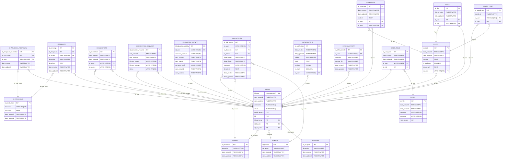

```mermaid
erDiagram
    CHAT_ROOMS {
        id_chat_room INT PK
        denumire VARCHAR(255)
        descriere TEXT
        date_created TIMESTAMPTZ
        date_updated TIMESTAMPTZ
    }

    CHAT_ROOM_INDIVIDUAL {
        id_chat_room_individual INT PK
        id_chat_room INT FK
        id_user VARCHAR(255) FK
        date_created TIMESTAMPTZ
        date_updated TIMESTAMPTZ
    }

    MESSAGES {
        id_message INT PK
        id_chat_room INT FK
        id_sender VARCHAR(255) FK
        denumire VARCHAR(255)
        descriere TEXT
        date_created TIMESTAMPTZ
        date_updated TIMESTAMPTZ
    }

    COMMENTS {
        id_comment INT PK
        date_created TIMESTAMPTZ
        date_updated TIMESTAMPTZ
        content TEXT
        id_post INT FK
        id_user VARCHAR(255) FK
    }

    CONNECTIONS {
        id_connection INT PK
        date_created TIMESTAMPTZ
        date_updated TIMESTAMPTZ
        id_user_1 VARCHAR(255) FK
        id_user_2 VARCHAR(255) FK
    }

    CONNECTION_REQUEST {
        id_connection_request INT PK
        date_created TIMESTAMPTZ
        date_updated TIMESTAMPTZ
        id_user_sender VARCHAR(255) FK
        id_user_receiver VARCHAR(255) FK
        status VARCHAR(255)
    }

    DOMENII {
        id_domeniu INT PK
        denumire VARCHAR(255)
        date_created TIMESTAMPTZ
        date_updated TIMESTAMPTZ
    }

    EDUCATION_ACTIVITY {
        id_education_activity INT PK
        id_user VARCHAR(255) FK
        denumire_institutie VARCHAR(255)
        data_inceput TIMESTAMPTZ
        data_sfarsit TIMESTAMPTZ
        denumire_profil VARCHAR(255)
        date_created TIMESTAMPTZ
        date_updated TIMESTAMPTZ
    }

    FUNCTII {
        id_functie INT PK
        denumire VARCHAR(255)
        date_created TIMESTAMPTZ
        date_updated TIMESTAMPTZ
    }

    JOB_ACTIVITY {
        id_job_activity INT PK
        id_user VARCHAR(255) FK
        id_domeniu INT FK
        id_functie INT FK
        data_inceput TIMESTAMPTZ
        data_sfarsit TIMESTAMPTZ
        companie VARCHAR(255)
        descriere TEXT
        date_created TIMESTAMPTZ
        date_updated TIMESTAMPTZ
    }

    LIKES {
        id_like INT PK
        date_created TIMESTAMPTZ
        date_updated TIMESTAMPTZ
        id_post INT FK
        id_user VARCHAR(255) FK
    }

    NOTIFICATIONS {
        id_notification INT PK
        date_created TIMESTAMPTZ
        date_updated TIMESTAMPTZ
        subject VARCHAR(255)
        body TEXT
        payload JSONB
        is_read BOOLEAN
        id_user VARCHAR(255) FK
    }

    OCUPATII {
        id_ocupatie INT PK
        denumire VARCHAR(255)
        date_created TIMESTAMPTZ
        date_updated TIMESTAMPTZ
    }

    OTHER_ACTIVITY {
        id_other_activity INT PK
        id_user VARCHAR(255) FK
        denumire VARCHAR(255)
        storage_file VARCHAR(255)
        date_created TIMESTAMPTZ
        date_updated TIMESTAMPTZ
    }

    POSTS {
        id_post INT PK
        date_created TIMESTAMPTZ
        date_updated TIMESTAMPTZ
        content TEXT
        is_published BOOLEAN
        image_url TEXT
        id_user VARCHAR(255) FK
    }

    ROLES {
        id_role INT PK
        date_created TIMESTAMPTZ
        date_updated TIMESTAMPTZ
        denumire VARCHAR(255)
        descriere VARCHAR(255)
        nivel_acces INT
    }

    SAVED_POST {
        id_saved_post INT PK
        saved_at TIMESTAMPTZ
        id_user VARCHAR(255) FK
        id_post INT FK
    }

    USERS {
        id_user VARCHAR(255) PK
        date_created TIMESTAMPTZ
        date_updated TIMESTAMPTZ
        username VARCHAR(255)
        email VARCHAR(255)
        profile_picture TEXT
        bio TEXT
        id_domeniu INT FK
        id_functie INT FK
        id_ocupatie INT FK
    }

    USER_ROLE {
        id_user_role INT PK
        date_created TIMESTAMPTZ
        date_updated TIMESTAMPTZ
        id_user VARCHAR(255) FK
        id_role INT FK
    }

    CHAT_ROOM_INDIVIDUAL }o--|| CHAT_ROOMS : "id_chat_room"
    CHAT_ROOM_INDIVIDUAL }o--|| USERS : "id_user"
    MESSAGES }o--|| CHAT_ROOMS : "id_chat_room"
    MESSAGES }o--|| USERS : "id_sender"
    COMMENTS }o--|| POSTS : "id_post"
    COMMENTS }o--|| USERS : "id_user"
    CONNECTIONS }o--|| USERS : "id_user_1"
    CONNECTIONS }o--|| USERS : "id_user_2"
    CONNECTION_REQUEST }o--|| USERS : "id_user_sender"
    CONNECTION_REQUEST }o--|| USERS : "id_user_receiver"
    EDUCATION_ACTIVITY }o--|| USERS : "id_user"
    JOB_ACTIVITY }o--|| USERS : "id_user"
    JOB_ACTIVITY }o--|| DOMENII : "id_domeniu"
    JOB_ACTIVITY }o--|| FUNCTII : "id_functie"
    LIKES }o--|| POSTS : "id_post"
    LIKES }o--|| USERS : "id_user"
    NOTIFICATIONS }o--|| USERS : "id_user"
    OTHER_ACTIVITY }o--|| USERS : "id_user"
    POSTS }o--|| USERS : "id_user"
    SAVED_POST }o--|| USERS : "id_user"
    SAVED_POST }o--|| POSTS : "id_post"
    USERS }o--|| DOMENII : "id_domeniu"
    USERS }o--|| FUNCTII : "id_functie"
    USERS }o--|| OCUPATII : "id_ocupatie"
    USER_ROLE }o--|| USERS : "id_user"
    USER_ROLE }o--|| ROLES : "id_role"
```